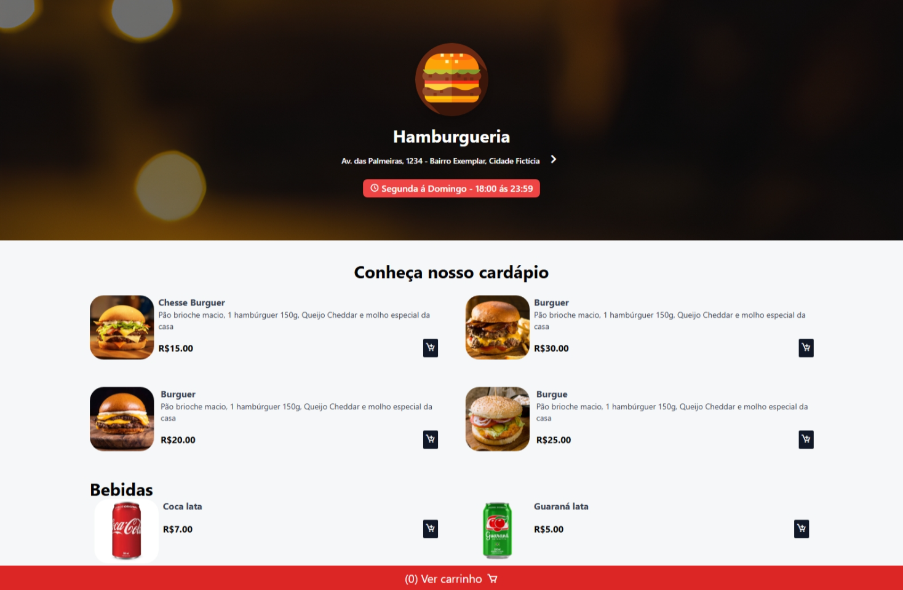
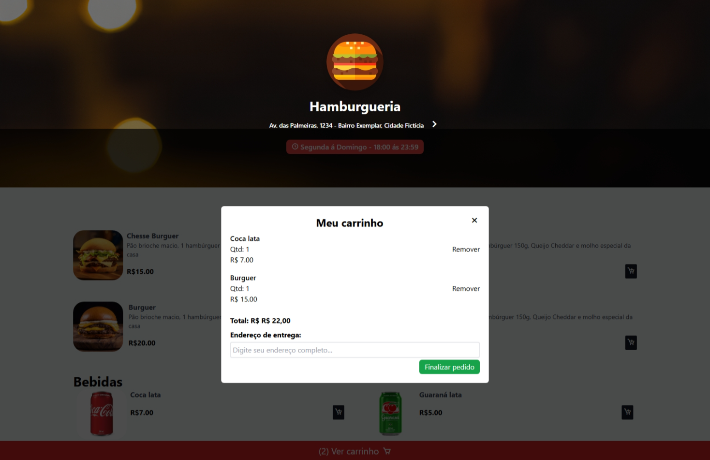

# 🍔 Sistema de Cardápio Web

## 📖 Descrição

Frontend de uma hamburgueria fictícia desenvolvido com **HTML**, **JavaScript** e **Tailwind CSS**, com foco em **design responsivo** e **interatividade**.

O sistema permite que o usuário visualize o cardápio, adicione itens ao carrinho e calcule o valor total do pedido, tendo integração com WhatsApp para envio de pedidos.

---

## ✨ Funcionalidades

* **Página inicial** com:

  * Logo e nome da hamburgueria
  * Endereço e horário de funcionamento
* **Cardápio** dividido em:

  * Hambúrgueres
  * Bebidas
* **Carrinho de compras**:

  * Adição e remoção de itens
  * Cálculo automático do total
  * Campo para endereço de entrega
* **Design responsivo**: funciona em **desktop** e **mobile**

---

## 🖼️ Prévia do Projeto

### Página inicial



### Carrinho de compras



---

## 🛠️ Tecnologias Utilizadas

| Tecnologia       | Finalidade                 |
| ---------------- | -------------------------- |
| **JavaScript**   | Lógica e interatividade    |
| **Tailwind CSS** | Estilização responsiva     |
| **HTML**         | Estrutura da interface web |

---

## 📦 Pré-requisitos

* **Node.js** (para rodar scripts e gerenciar pacotes)

---

## 🚀 Como executar

1. Clone o repositório:

```bash
git clone https://github.com/vitorkloy/burger-menu.git
cd burger-menu
```

2. Instale as dependências:

```bash
npm install
```

3. Inicie o servidor (pode usar o **Live Server** ou algum servidor local do Node):

```bash
npm run dev
```
